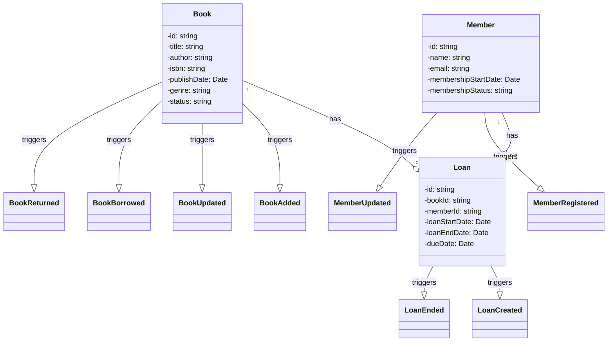

### Event Store DB Example

This repository contains an example of how to use the Event Store DB Client API for Typescript. The vision is to use the minimal set of dependencies to make it easy to understand how to use the API. This is the stack we use:

* [Event Store DB Client API](https://developers.eventstore.com/clients/grpc/?codeLanguage=NodeJS)
* [Node Test Runner](https://nodejs.org/api/test.html)
* [TSX](https://github.com/privatenumber/tsx#readme)

The Domain used here is a simple library system that registers Members and lend Books to them. Here are the main entities:

### Book

**Attributes**:
* id: A unique identifier for the book.
* title: The title of the book.
* author: The author(s) of the book.
* isbn: The International Standard Book Number.
* publishDate: The date the book was published.
* genre: The genre of the book.
* status: Current status (e.g., Available, Borrowed).

**Events**:
* BookAdded
* BookUpdated
* BookBorrowed
* BookReturned

### Member

**Attributes**:
* id: A unique identifier for the member.
* name: The name of the member.
* email: The member's email address.
* membershipStatus: Status of the membership (e.g., Active, Inactive).
* membershipStartDate: The start date of the membership.

**Events**:
MemberRegistered
MemberUpdated

### Loan

**Attributes**:
* id: A unique identifier for the loan.
* bookId: The ID of the borrowed book.
* memberId: The ID of the member who borrowed the book.
* loanStartDate: The start date of the loan.
* loanEndDate: The end date of the loan (if returned).
* dueDate: The due date for returning the book.

**Events**:
* LoanCreated
* LoanEnded

### Diagram

